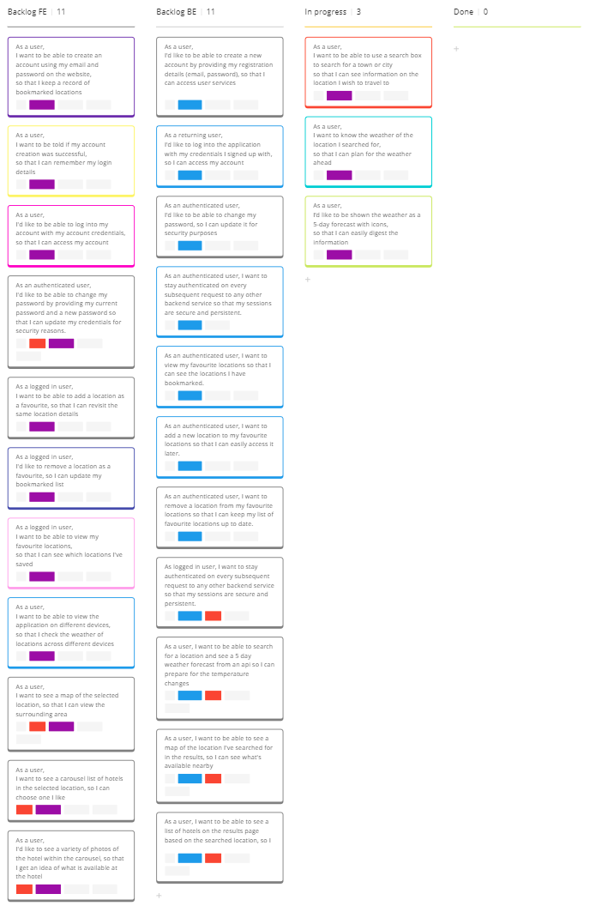
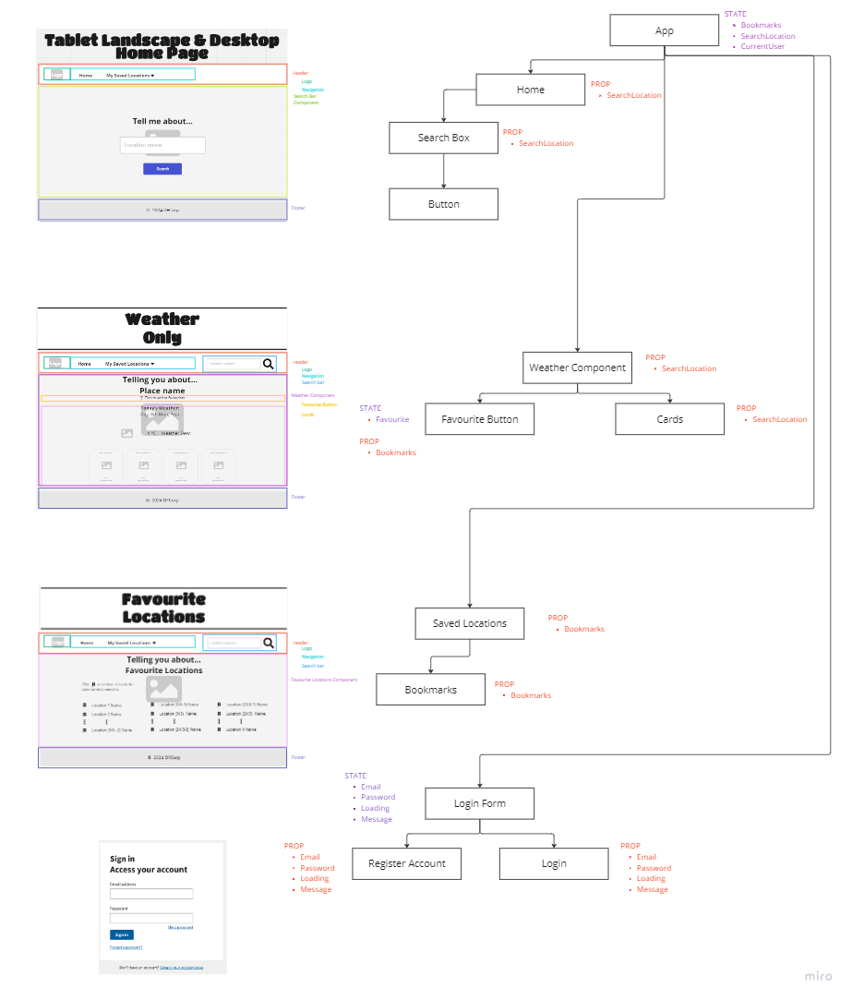
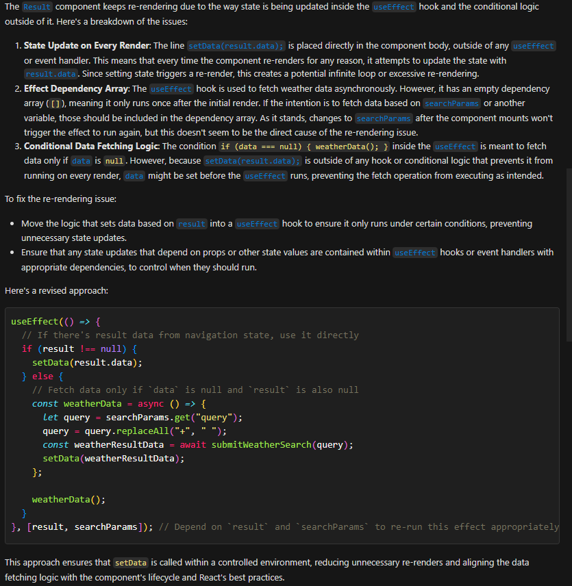
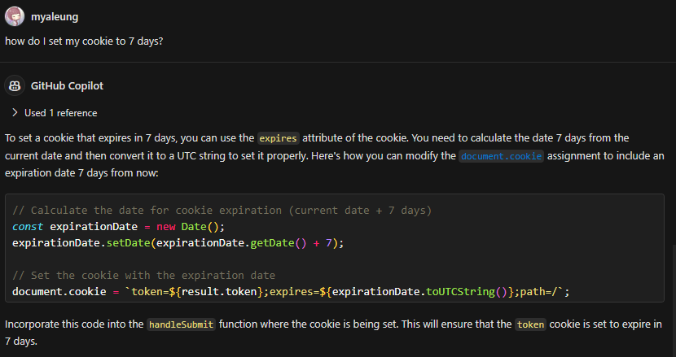
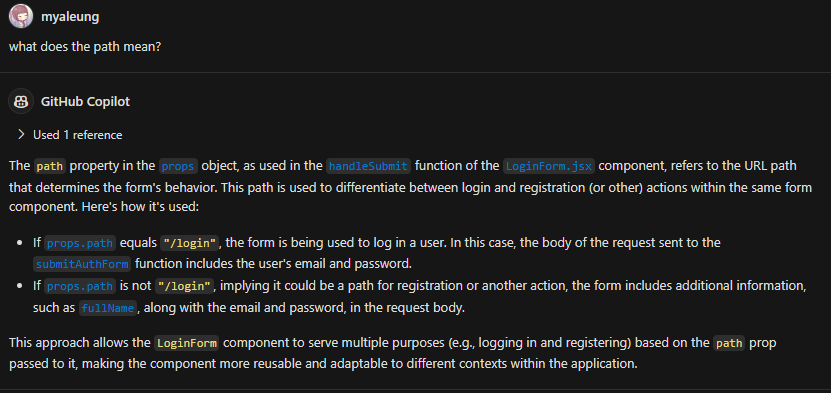
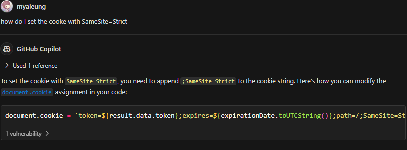
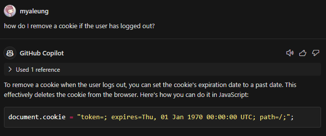
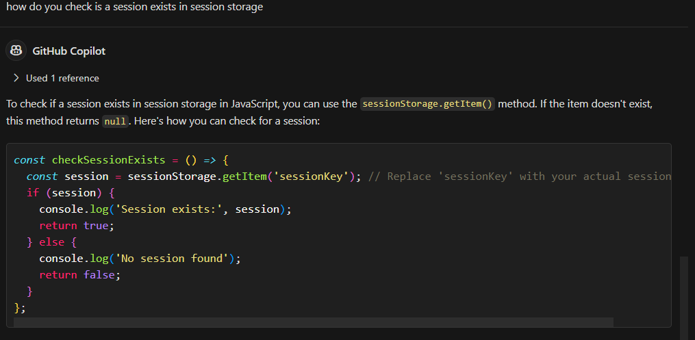
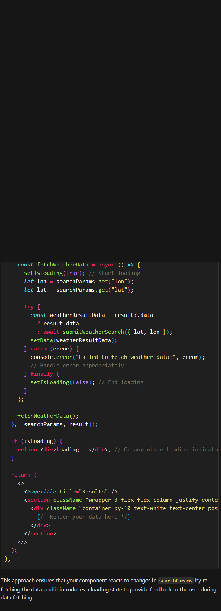

# User Stories & Hierarchy Diagrams
### User Story 1
As a user, I want to know the weather of the location I searched for, so that I can plan for the weather ahead.  

### User Story 2
As a user, I want to be able to use a search box to search for a town or city, so that I can see information on the location I wish to travel to.  

### User Story 3
As a user, I’d like to be shown the weather as a 5-day forecast with icons, so that I can easily digest the information.  

### User Story 4
As a user, I want to be able to create an account using my email and password on the website, so that I keep a record of bookmarked locations.  

### User Story 5
As a user, I want to be told if my account creation was successful, so that I can remember my login details.  

### User Story 6
As a user, I'd like to be able to log into my account with my account credentials, so that I can access my account.  

### User Story 7
As a logged in user, I want to be able to add a location as a favourite, so that I can revisit the same location details.  

### User Story 8
As a logged in user, I'd like to remove a location as a favourite, so I can update my bookmarked list.  

### User Story 9
As a logged in user, I want to be able to view my favourite locations, so that I can see which locations I've saved.  

### User Story 10
As an authenticated user, I'd like to be able to change my password by providing my current password and a new password so that I can update my credentials for security reasons.  

### User Story 11
As a user, I want to see a map of the selected location, so that I can view the surrounding area.

### User Story 12
As a user, I want to see a carousel list of hotels in the selected location, so I can choose one I like.

### User Story 13
As a user, I'd like to see a variety of photos of the hotel within the carousel, so that I get an idea of what is available at the hotel.

## Miro Board
A kanban board on Miro was used to track my user story tasks as well as plan the project.  
https://miro.com/app/board/uXjVKCXWVNQ=/?share_link_id=310189384549



## Hierarchy & UseState
Using the wireframes, I broke down the hierarchy of components and planned out some useStates for the components.  
(See: https://miro.com/app/board/uXjVKCXWVNQ=/?moveToWidget=3458764590630353119&cot=14)  


However, after building the site, it was clear that a lot of the state, especially for bookmarks could be controlled from server-side and thus was removed from the final frontend.

## GenAI
### Weather Results
During the creation of my weather results page, there was an error where my results were re-rendering and causing the application to stop. I asked Co-Pilot for some help:

I used this to update my method and moved it to an useEffect with dependency on when it re-runs.

### JWT cookie
After setting up JWT on the backend, I needed a way to utilise the token on the frontend and thought to store it as a cookie which I could remove when they logout or when it expires.

From the code Co-Pilot returned I wasn't too sure about the `path=/` code and questioned what it meant:

I therefore used it to adjust my code accordingly.
After setting this cookie up, I had a warning about `SameSite-Strict` on my console. After some research I understood that this was telling the cookie if it was coming solely from my site or if it was set via a third party site. I then asked Co-Pilot about how to set this in my function.


#### Logout
To logout of the account I had to remove the cookie from the browser. I asked Co-Pilot how to do this and was told to set it to a past date, essentially rendering it as expired.


I also had to include adding a user to session storage so that I can easily grab this information later around the site to show their bookmarks. I asked Co-Pilot how I could be able to grab the session storage to implement this.
  
I ended up changing this to local storage so the data persists even when changing tab.

### Results Page
My results page queried and loaded the results fine but I found that if you were on the `/results` path already, clicking on another results link wouldn't redirect or load the new data. I therefore asked Co-Pilot how I could resolve this and make the page reload the data per new saved location result.

_My old code_
```javascript
useEffect(() => {
    const weatherData = async () => {
      let lon = searchParams.get("lon");
      let lat = searchParams.get("lat");
      const weatherResultData = await submitWeatherSearch({lat: lat, lon: lon });
      setData(weatherResultData);
    };
    if (result !== null) {
      setData(result.data);
    }

    if (data === null) {
      weatherData();
    }
  }, [data, searchParams, result]);
```
_Co-Pilot Update_


I ended up needing to change the useEffect to reload on search params updating and also when the results data changes, calling the function again.